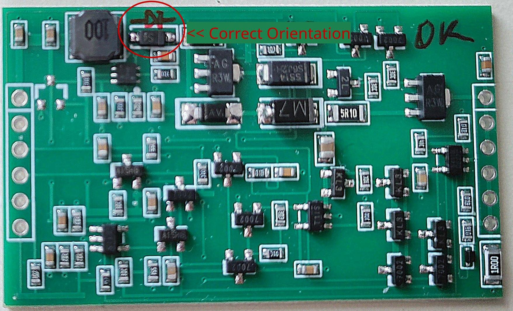

# MBusino 5S - Enhanced Fork
[](CHANGELOG.md)<br/>

> **Fork Notice:** This is a fork of the fantastic original [MBusino](https://github.com/Zeppelin500/MBusino) project by Zeppelin500. It focuses entirely on the 5-Slave (5S) version and introduces a completely redesigned responsive Web-UI, a dynamic JSON Profile Manager, and ESP-NOW support.
Please note, that i cannot provide Support - be aware that it possibly would take Time for me to reply and/or implement Fixes if Bugs occour.

### You want to support me?
[](https://paypal.me/DeinPayPalName)

### M-Bus --> MQTT-Gateway with shields for ESPs

A **Plug and Play** solution for smart home integration.

M-Bus decoding uses the library [**MBusinoLib**](https://github.com/Zeppelin500/MBusinoLib). The serial data link layer communication is handled by [**MBusCom**](https://github.com/Zeppelin500/MBusCom).

## ✨ New Features in this Fork

* **Completely Redesigned Web-UI:** A modern, dark-themed, and fully mobile-responsive interface. 
* **Dynamic Profile Manager:** No more hardcoded profiles! Upload custom `.json` M-Bus profiles directly via the Web-UI, assign them to slaves, or download system templates to edit them.
* **ESP-NOW Integration:** Send sensor and M-Bus data directly to other ESP-NOW capable devices without needing an MQTT broker in between.
* **Smart Calibration UI:** Easily calibrate your OneWire DS18B20 sensors to an average value or a specific target temperature with a single click.
* **Bulletproof Layout:** Fixed severe template engine bugs from the underlying webserver that previously broke the UI on mobile devices.

## Hardware

This fork supports the same hardware as the original MBusino 5s. 
- M-Bus e.g. heatmeter (up to five slaves)
- OneWire 5x DS18B20, temperature
- I²C BME280, temperatur, r. humidity, air pressure

You will find the original provided 3D-printable PCB case inside the `case` folder.

### ⚠️ Hardware Warning: DykbRadio MBUS-TTL Module

If you are using the **DykbRadio MBUS-TTL** module, please double-check the orientation of the diode located right next to the 100mH inductor!

On many of these modules shipped from the factory, this diode is soldered backwards. This results in the following symptoms:
* The module does not work at all (you will measure 0V instead of ~30V between the `M+` and `M-` pins).
* The module gets extremely hot, especially in the area around the inductor.

**The Fix:** To correct this, you need to desolder the diode, rotate it by 180°, and solder it back into place. 


*The image above shows the **correct** orientation of the diode after the fix.*

**Replacement Part:**
If you happen to lose or damage the diode during the modification, you can replace it with almost any standard Schottky diode. 
* **Voltage/Current:** A minimum rating of 60V and ~1A.
* **Package Size:** The footprint on the PCB matches a standard **SOD-123** package (body length ~2.6mm). The original marking "S4" usually corresponds to a generic 40V/1A Schottky diode (e.g., B140HW, 1N5819HW, or similar).

## Setup

### Access Point to configure
* SSID **MBusino Setup Portal** IP(normally not needed): 192.168.4.1
* If Mbusino does not find a known network, it starts an AP for 5 minutes. After this period, it will restart and search again.

### 🔑 Default Credentials & Access
After a fresh flash, MBusino uses the following defaults:
* **Web-UI Password:** *None*
* **OTA Update Password:** `mbusino`

### 🚑 Emergency Web-UI Unlock (Double-Reset Trick)
If you forgot your Web-UI password or locked yourself out, you can temporarily bypass the login screen:
1. Press the `RESET` button on the ESP board twice quickly (within 1.5 seconds).
2. The internal LED will blink twice rapidly to confirm.
3. You now have exactly 15 minutes to access the Web-UI without a password and change your settings.

### 🛟 Smart Island Mode (Fallback AP)
If MBusino loses connection to your router (or if no credentials are provided), it will automatically start a Fallback Access Point.
* **SSID:** `[YourDeviceName]_AP_mode` (e.g. `MBusino_AP_mode`)
* **Password:** *None* (Open Network)
* **IP Address:** `192.168.4.1`
* *Note:* If a configured router becomes available again, MBusino will automatically detect it in the background and reconnect, seamlessly disabling the AP.
*         To have the Device in permanent AP-Mode (standalone) simply delete all Wlan Credentials in the Network Tab.

## 📡 ESP-NOW Integration

MBusino can operate as a headless bridge, broadcasting all parsed M-Bus and sensor data directly to other ESP8266/ESP32 devices (like Solar Controllers, Smart Displays, or custom relays) via **ESP-NOW**. This bypasses the WiFi router and MQTT broker entirely, providing an ultra-low latency and highly reliable connection.

* **Target MAC:** Can be configured in the Web-UI. Use `FF:FF:FF:FF:FF:FF` to broadcast to all listening devices, or specify a dedicated receiver MAC.
* **Transmission:** Data is pushed dynamically every 5 seconds.

### Receiver Payload Structure (C++)
To receive the data on another ESP, use the following `struct`. It is exactly 175 Bytes long and packed to prevent memory padding issues. The `magic` header and `system_id` allow you to filter out packets from other devices which enables the use of multible MBusino Devices broadcasting via ESP-NOW.

```cpp
typedef struct __attribute__((packed)) {
  char magic[5];            // Magic Header: 'M', 'B', 'I', 'S', 'P'
  uint8_t version;          // Protocol Version (currently 1)
  uint32_t system_id;       // Unique ID (FNV-1a Hash of the MBusino Network Name)

  struct {
    uint32_t fab_number;    // Fabrication Number (e.g., 72532544). 0 = unused/offline
    uint8_t status;         // Standardized Status Byte (0-7):
                            // 0: OK, 1: Deadband active, 2: Min Flow Limit warning,
                            // 3: Max Flow Limit warning, 4: Max Power Limit warning,
                            // 5: Bouncer Hold (Values frozen), 6: Bouncer Timeout,
                            // 7: Offline / Fatal Error (Values are NaN)
    float energy;           // Current energy reading (usually kWh or MWh)
    float volume_flow;      // Current flow rate in m³/h
    float power;            // Current power in kW
    float flow_temp;        // Forward temperature in °C
    float return_temp;      // Return temperature in °C
  } meters[5];              // Data for up to 5 M-Bus Slaves

  float ds18b20[7];         // Data for 7 OneWire Sensors in °C (-127.0 = invalid)
  
  struct {
    float temperature;      // °C (-127.0 = invalid)
    float pressure;         // hPa (0.0 = invalid)
    float humidity;         // % (-1.0 = invalid)
  } bme;                    // BME280 Environment Sensor
} ESPNowPayload;

## Credits & License
* **Original Creator:** Zeppelin500 (Thank you for the amazing work!)
* **UI/UX & Feature Enhancements:** [aut0mat3d](https://github.com/aut0mat3d)
* AllWize for the MbusPayload library
* HWHardsoft and TrystanLea for the M-Bus communication

## 💻 Software Requirements

To compile this project with the Arduino IDE (Version 1.8.19 recommended), you need the following libraries.

### 1. Manual Installation (Download as .zip)
These libraries are specific to the MBusino project and must be downloaded from GitHub and added via `Sketch -> Include Library -> Add .ZIP Library...`:

* [**MBusinoLib**](https://github.com/Zeppelin500/MBusinoLib) (Decoding logic)
* [**MBusCom**](https://github.com/Zeppelin500/MBusCom) (Serial communication layer)

### 2. Arduino Library Manager
Search for and install the following libraries directly in the IDE (`Tools -> Manage Libraries...`):

| Library Name | Version (tested) | Purpose |
| :--- | :--- | :--- |
| **ArduinoJson** | 6.x or 7.x | Config & Profile handling |
| **ESPAsyncWebServer** | Latest | Web Interface |
| **AsyncTCP** (for ESP32) | Latest | Webserver dependency |
| **ESPAsyncTCP** (for ESP8266) | Latest | Webserver dependency |
| **PubSubClient** | Latest | MQTT communication |
| **OneWire** | Latest | DS18B20 Bus communication |
| **DallasTemperature** | Latest | Temperature sensor logic |
| **Adafruit BME280 Library** | Latest | I2C Sensor support |
| **Adafruit Unified Sensor** | Latest | Base for BME280 |

### 3. Board Support (Boards Manager)
Make sure you have installed the following cores via `Tools -> Board -> Boards Manager...`:
* **esp32** by Espressif Systems
* **esp8266** by ESP8266 Community

*Note: Built-in libraries like `LittleFS`, `WiFi`, `ESPmDNS`, `ArduinoOTA`, and `esp_now` are included in the board cores and do not need separate installation.*

This program is free software: you can redistribute it and/or modify it under the terms of the GNU General Public License as published by the Free Software Foundation, either version 3 of the License, or (at your option) any later version.
